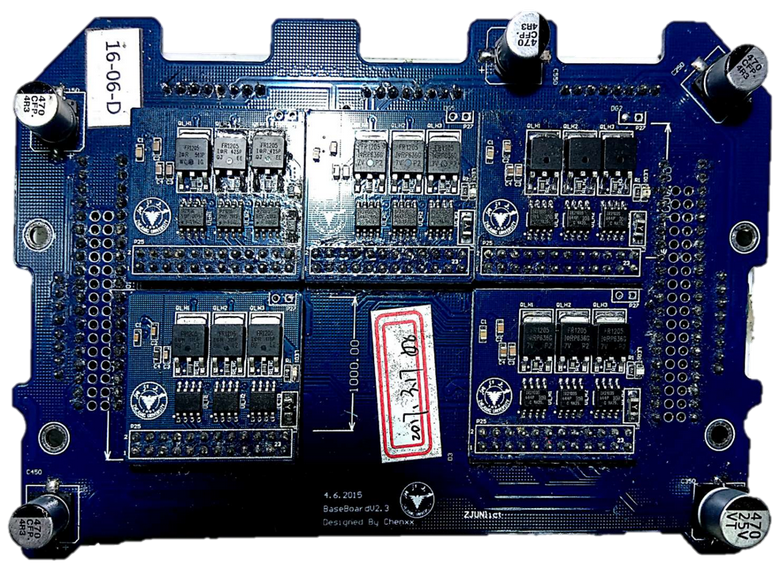
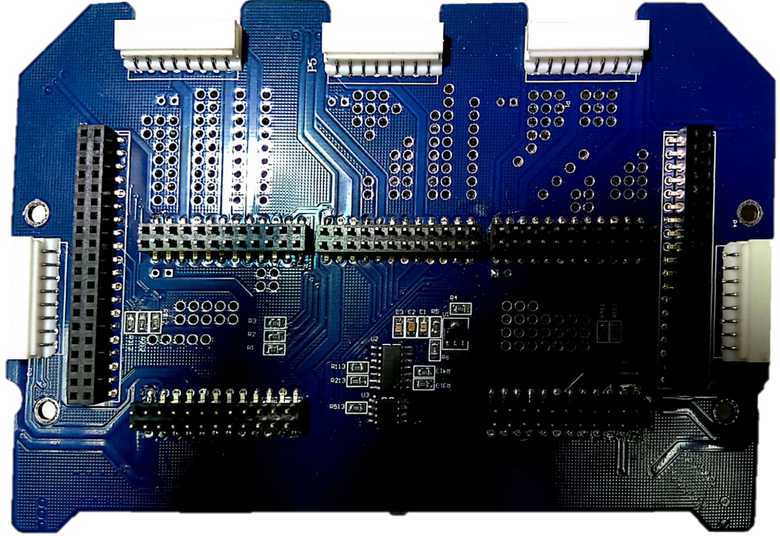

# ZJUNlict Motor Driver Board

The motor driver board is used to drive the motor and report the over current signal to the [mother board](https://github.com/ZJUNlict/Mother_Board). (The board is designed using [Altium Designer](https://www.altium.com/altium-designer/) 17.1)

We use half-bridge driver shown in the figure below for BLDC motors. 

The main features are:

* Use half-bridge driver(IR2103) to drive MOSFETs(IRFR1205) with internal set deadtime to reduce the complex of core board driver algorithm.
* Current sensor(ACS712) measures the current draw of each motor. Then the comparator(LM339) compares the output voltage signal with reference voltage to detect overcurrent scenarios.
* Motor driver boards uses modular design. One Half-bridge module handles one motor for easier fault identification and quick replacement.

The photos of the motor driver board are shown below as references. 

